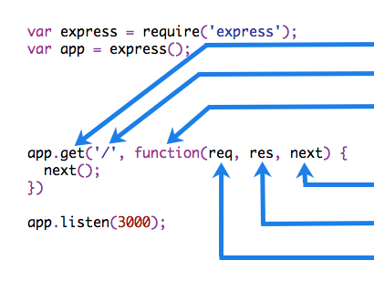

# Writing middleware for use in Cute Express apps

## Overview

Middleware functions are functions that have access to the [request object (req)](/api_reference/api_reference_1.x.html#request), the [response object (res)](/api_reference/api_reference_1.x.html#response), and the next function in the application’s request-response cycle. The next function is a function in the Cute Express router which, when invoked, executes the middleware succeeding the current middleware.

Middleware functions can perform the following tasks:

- Execute any code.

- Make changes to the request and the response objects.

- End the request-response cycle.

- Call the next middleware in the stack.

If the current middleware function does not end the request-response cycle, it must call next() to pass control to the next middleware function. Otherwise, the request will be left hanging.

The following figure shows the elements of a middleware function call:

|                                              |                                                                                                                                                                                                                                                                                                                                                                                                                                                                                                                                                                                        |
| -------------------------------------------- | -------------------------------------------------------------------------------------------------------------------------------------------------------------------------------------------------------------------------------------------------------------------------------------------------------------------------------------------------------------------------------------------------------------------------------------------------------------------------------------------------------------------------------------------------------------------------------------- |
|  | HTTP method for which the <br>middleware function applies. <br><br> Path (route) for which the <br>middleware function applies.<br><br> The middleware function. <br>Callback argument to the <br>middleware function, called "next" by convention.<br><br> HTTP [response](/api_reference/api_reference_1.x.html#request) argument to the <br>middleware function, called "res" by convention. <br><br> HTTP [request](/api_reference/api_reference_1.x.html#response) argument to the <br>middleware function, called "req" by convention. |


## Example

Here is an example of a simple “Hello World” Cute Express application. The remainder of this article will define and add three middleware functions to the application: one called myLogger that prints a simple log message, one called requestTime that displays the timestamp of the HTTP request

```js
const cuteExpress = require('cute-express')
const app = cuteExpress()

app.get('/', (req, res) => {
  res.send('Hello World!')
})

app.listen(3000)
```

### Middleware function myLogger

Here is a simple example of a middleware function called “myLogger”. This function just prints “LOGGED” when a request to the app passes through it. The middleware function is assigned to a variable named myLogger.

```js
const myLogger = function (req, res, next) {
  console.log('LOGGED')
  next()
}
```

:::info
Notice the call above to next(). Calling this function invokes the next middleware function in the app. The next() function is not a part of the Node.js or Cute Express API, but is the third argument that is passed to the middleware function. The next() function could be named anything, but by convention it is always named “next”. To avoid confusion, always use this convention.
:::

To load the middleware function, call app.use(), specifying the middleware function. For example, the following code loads the myLogger middleware function before the route to the root path (/).

```js
const cuteExpress = require('cute-express')
const app = cuteExpress()

const myLogger = function (req, res, next) {
  console.log('LOGGED')
  next()
}

app.use(myLogger)

app.get('/', (req, res) => {
  res.send('Hello World!')
})

app.listen(3000)
```

Every time the app receives a request, it prints the message “LOGGED” to the terminal.

The order of middleware loading is important: middleware functions that are loaded first are also executed first.

If myLogger is loaded after the route to the root path, the request never reaches it and the app doesn’t print “LOGGED”, because the route handler of the root path terminates the request-response cycle.

The middleware function myLogger simply prints a message, then passes on the request to the next middleware function in the stack by calling the next() function.


### Middleware function requestTime


Next, we’ll create a middleware function called “requestTime” and add a property called requestTime to the request object.


```js
const requestTime = function (req, res, next) {
  req.requestTime = Date.now()
  next()
}
```

The app now uses the requestTime middleware function. Also, the callback function of the root path route uses the property that the middleware function adds to req (the request object).

```js
const cuteExpress = require('cute-express')
const app = cuteExpress()

const requestTime = function (req, res, next) {
  req.requestTime = Date.now()
  next()
}

app.use(requestTime)

app.get('/', (req, res) => {
  let responseText = 'Hello World!<br>'
  responseText += `<small>Requested at: ${req.requestTime}</small>`
  res.send(responseText)
})

app.listen(3000)
```

When you make a request to the root of the app, the app now displays the timestamp of your request in the browser.


## Configurable middleware

If you need your middleware to be configurable, export a function which accepts an options object or other parameters, which, then returns the middleware implementation based on the input parameters.

File: my-middleware.js

```js
module.exports = function (options) {
  return function (req, res, next) {
    // Implement the middleware function based on the options object
    next()
  }
}
```

The middleware can now be used as shown below.

```js
const mw = require('./my-middleware.js')

app.use(mw({ option1: '1', option2: '2' }))
```